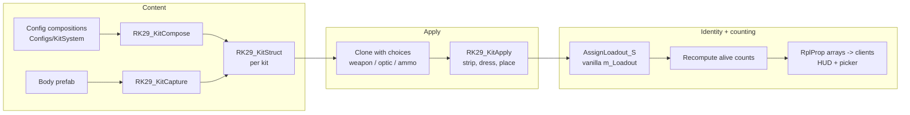

# 29th Kit System — Runtime

How a kit reaches a player: the picker, the apply pass, identity and counting, and the
round-phase gating that decides when any of it is available.

Companion to [`29th-kit-config-backend-design.md`](29th-kit-config-backend-design.md),
which covers where kit *content* comes from. This doc treats a kit as a resolved
`RK29_KitStruct` and never asks how it was built.

---

## 1. What it does

The mod replaces vanilla respawn-menu loadout selection with a unit-controlled kit system.

- A player picks a **class** from the list their squad is offered, then a **primary
  weapon** and — where the class allows it — an **optic**, *None* included.
- Kits can be swapped **on a living body during preround**, with zero displacement: not
  moved an inch, no pose, stance or camera reset.
- A **briefing HUD** shows how many of each kit are alive on the player's team, with a
  magnified-optic tally per kit.

Optic editing is per-class config data. A class that lists optic categories gets an
interactive optic column; one that lists none shows its default optic in a locked row.
Widening that to another class is a config edit and no code.

### Out of scope

Customization stops at primary weapon and optic. There is no ammo or grenade quantity
picker, no secondary or equipment editing, no personal kit save/load, no hard enforcement
of kit limits, and no HUD after briefing. The counting layer already computes what limits
and a mid-round HUD would need; see §11.

---

## 2. Player experience

**At deploy.** The respawn menu lists 29th kits only — `GM29_KitLoadouts` injects them
into `SCR_LoadoutManager` and prunes entries the unit did not author. Picking one spawns
the body; the kit system dresses it.

**Alive in briefing.** `F4` opens the picker (`RK29_ToggleKitMenu`, bound in the
character, in-game and deploy-menu action contexts). Pick a class or change the
customization, apply, and the living body is re-dressed in place.

**The picker** runs in the vanilla `ConfigurableDialog_Big` shell, titled `SELECT KIT`,
with **Apply Kit** as a dialog footer button beside Close (`Space` also applies). Columns
run left to right: class → weapon → optic.

- The class column is limited to what the player's squad offers (§6).
- The optic column is filtered to optics that physically fit the selected weapon, each
  badged `1X` or `MAG`.
- Selections are **per class**. Swapping class swaps the customization context; an optic
  choice never carries across classes.

**Optic seeding.** Selecting a class pre-selects its configured default optic, so taking
glass is opt-*out* for a marksman rather than something a player forgets. On a weapon
change: keep the current optic if it fits, else the class default if that fits, else
*None*. A failed optic swap restores the previous optic rather than leaving irons.

**The HUD** sits on the left during briefing only: role icon, alive count, and a
parenthesised magnified count with a scope glyph, omitted when zero. Zero-count rows are
hidden and row order follows the roster's class order. It is shown to every connected
player including the dead and deploy-menu sitters, so leadership can read counts without
a body.

---

## 3. Architecture

Three layers, deliberately decoupled — how gear gets on a body never decides who counts
as what.



Swapping either end leaves the other untouched. `RK29_KitStruct` is the contract between
them.

---

## 4. Where a struct comes from

`RK29_KitManager.Boot` builds one `RK29_KitStruct` per class, on every machine.

A class with an `m_sComposition` is composed from config. A class without one is captured
from its resolved body prefab — the same reader, kept as the path for anything not yet
config-authored. Composition is the normal case; the backend doc owns the details.

Boot runs two passes: the loadout walk first, then every `RK29_ClassSetup` not already
built. `m_aIndexToKit` therefore grows past the loadout count. Every consumer iterates it
by position and never maps back to the loadout manager, and it is built identically on
server and client.

The un-optioned composition is kept beside the fielded kit in `m_mKitsBase`. Every weapon
choice is laid over that base, never over an already-optioned kit — otherwise a weapon's
blocks stack a second time.

---

## 5. Apply

Authority only, in place, synchronous. The entity never changes, which is what makes zero
displacement structural rather than something to test for.

1. **Strip** the body — every garment, weapon slot and loose item.
2. **Dress** clothing into named slots, then equipment slots (wristwatch, binoculars).
3. **Insert weapons** into their slots and seat the optic.
4. **Place items** by the constraint solver (backend doc §9), grenades primed into the
   throwable slot first.
5. **Apply traits** — the kit's qualification labels, written even when empty.

Four rules the apply pass is built around:

- **Strip fully before dressing.** Partial strips leave orphans — the old weapon's
  magazines in a pocket outlive the weapon.
- **Attachments last.** Anything depending on another part (a magazine on an adapter, a
  bayonet on a muzzle) goes on after the weapon is fully spawned.
- **Same-prefab keep.** A slot already holding the right prefab is left alone, so an
  optic-only change does not re-dress the character.
- **Snap items into hands, never animate.** A held gadget is equipped by writing the hand
  slot directly; an animated transition out of a stale graph jams.

Dropped items are logged at WARNING server-side and named to the player by owner-RPC.
There is no mathematical fit guarantee — `kitvalidate` is how a kit is proven to fit
before it ships.

---

## 6. Squad gating

`GetOfferedKits` answers "what may this player take", in authority order:

1. The squad kit catalog, keyed on the name the group's **preset** declares.
2. The vanilla group loadout lists.
3. Every kit for the player's faction.

The preset name, not the runtime name, is identity. Vanilla's create-group dialog opens
with an empty name box and then overwrites whatever the preset set with the typed text,
so a group created as "29th HQ" reports an empty custom name; the name also crosses an
async profanity filter and reads back empty on clients for a while. The group's **role**
is a plain replicated int carried in `RplSave`/`RplLoad`, so
`FindGroupRolePresetConfig()` maps it back to the authored config reliably.

A group created with no role — vanilla's `RPC_AskCreateGroup` path — has neither role nor
name, and vanilla's own deploy filter matches presets by role too, so it would hand that
player an empty deploy menu. `GM29_Groups.conf` therefore carries a hidden `NONE` preset
mirroring the rifle squad, with `m_bCanBeCreatedByPlayer 0` to keep it out of the
create-group dialog.

The server applies the same filter at apply time. The picker's list is a convenience; it
is not what is trusted.

---

## 7. Identity and counting

**The assigned loadout is the only honest record of a player's class**
(`SCR_PlayerLoadoutComponent.m_Loadout`), updated in the apply chokepoint through an
additive wrapper over the protected vanilla chain (`CanAssignLoadout_S` →
`AssignLoadout_S`). Vanilla's per-loadout counts, game-mode notifications and next-respawn
kit all stay consistent for free.

> After an in-place swap the body's `GetPrefabData()` still names its birth prefab, and
> always will. Never derive class from the entity, the struct or a string — ask the
> assignment.

**Role icons** come from the body's editable-entity UI info, which the GM editor list and
Spectator V3 both read. The kit system stamps a per-body instance via
`SetInfoInstance` at spawn, then on every later swap **mutates that instance's fields**
rather than replacing it. Consumers that cache the reference — the spectator caches once
per entity appearance and re-renders from it — follow along for free. Swapping the
instance would strand every cacher on the old object.

`SetInfoInstance` is local, not replicated, so the stamp runs per machine off the
replicated assignment info. The instance is `RK29_KitUIInfo : SCR_EditableEntityUIInfo`,
created with `new` and never config-deserialized, so it survives the spectator's cast.

**Traits are authoritative on a kitted body.** Vanilla unions instance labels with the
prefab's, so a body could only ever gain labels — wrong when the body is an
implementation detail and re-kitting medic → rifleman must actually stop the player being
a medic. `RK29_CharacterLabels.c` mods `SCR_EditableCharacterComponent`: one replicated
flag says "the kit system dressed this body", and `GetAllCharacterLabels` then returns the
kit's list alone. Anything the kit system never dressed keeps vanilla behaviour.

**Alive counts are rebuilt, never incremented.** Subscriptions on `OnPlayerSpawned`,
`OnPlayerKilled`, `OnPlayerDeleted` / `OnControllableDestroyed`, `OnPlayerDisconnected`
and `OnPlayerLoadoutSet_S` all funnel into one debounced `Recompute()`; the last covers
re-kits for free because apply routes through `AssignLoadout_S`.

Increments would need every event to fire exactly once, in order, with complete coverage —
unverifiable across game updates and a large mod pack, and one miss corrupts the counter
permanently. A rebuild depends only on present state, so a missed event costs one stale
frame. It is O(players).

Counts mean **alive bodies, not claims**. Unconscious counts as alive. A dead player on a
respawn timer does not count; neither does a menu pick with no body yet.

```
[RplProp(onRplName: "OnRK29CountsChanged")] ref array<int> m_aRK29AliveCounts;
[RplProp(onRplName: "OnRK29CountsChanged")] ref array<int> m_aRK29MagnifiedCounts;
```

Rebuilt arrays are assigned, not mutated in place, so replication notices. HUD and picker
both subscribe and rebuild their whole panel on any fire, which makes them immune to
notification granularity.

---

## 8. Client → server flow

```
picker APPLY ──RPC (playerController, RK29_-prefixed)──▶ server chokepoint:
  1. validate: preround phase, class exists for this faction and squad, weapon in the
     class list, optic in an allowed category and fits the weapon
  2. clone the base struct, apply weapon / optic / ammo choices
  3. full-heal the body if alive
  4. apply to the living body, or stash for spawn-time if dead
  5. RK29_AssignLoadout_S — identity update, atomic with the apply
  6. OnPlayerLoadoutSet_S -> Recompute() -> RplProp -> every HUD updates
```

The client is never trusted; every field is re-validated here. Steps 3–5 live in one
server function so the ledger can never disagree with the body.

**The heal.** A live re-kit is preround-only, so anything wrong with the body is
staging-area damage and a clean loadout deserves a clean body. `RK29_KitHeal` clears
tourniquets first (they are items, so no heal can see them, and a tourniquetted limb
counts as 70% damaged whatever its hitzones say), calls `FullHeal(false)`, tops up the
sub-threshold damage `FullHeal` skips — its first damage state is 0.75 on health and 0.7
on limbs, so alone it leaves a player at 76% — then wakes them, forcing stance to STAND so
a revive does not put them straight back down.

`FullHeal` is the virtual call the Game Master's heal action makes and the one medical
mods override, which is what makes this compatible by construction. `false` rather than
the GM's default because a re-kit is a reset, not a battlefield heal.

**Stash validity.** Selections live in server memory, keyed per player and per class.
They are validated at both read sites, so a faction or squad change cannot hand a player
a kit they may no longer take. A body already wearing the old gear keeps it until the next
apply.

---

## 9. Round phase

"Preround" means the 29th Round Timer's phase is **not LIVE** — briefing, no round set up,
and post-round all count as open. The HUD is stricter and shows during BRIEFING only.

Integration is soft and one-directional. An `RK29_` probe locates the timer's `m_eRTPhase`
RplProp on the game mode by name through Enforce reflection
(`typename.GetVariableName` / `GetVariableValue`). All vanilla types, no compile-time
reference either way, and the Round Timer is never modified.

The field is type-level, so one look at a live game mode settles it for the world. With
the addon absent the probe stays inactive and `m_bNoTimerOpen` in `RK29_KitSetup.conf`
governs — default **closed**: no HUD, no live re-kit, kit choice at deploy only. Flip it
open for dev or casual sessions.

The phase is checked **server-side in the apply chokepoint** as well; the client probe
only drives UI. The field name is mirrored from the Round Timer's source, so a rename
there degrades silently to fallback mode — re-verify after Round Timer updates.

---

## 10. Conventions and compatibility

- **Additive modding throughout.** Every added member and method is `RK29_`-prefixed,
  every override calls `super` unless documented otherwise, and predicates are widened
  rather than replaced.
- **Never `modded class` a config-deserialized class.** New `BaseContainerProps` classes
  are fine.
- **No `RespawnMenu.layout` override.** 29th Spectator V3 owns that file and only one
  override of a resource wins. Deploy-menu UI is script-injected at menu open.
- **Chat diagnostics are server-side only.** Vanilla mints a command invoker for any name
  and dispatches on the typing client with no permission model, so the gate is ours.
- **Nothing player-facing may depend on Diag-only APIs.** Peer-tool tests are Diag-to-Diag
  and prove nothing about retail.
- **Other mods keying off body prefab names** — trackers, admin tools — will misread
  class-swapped players. Known exposure.

---

## 11. Known gaps

**Deploy preview shows prefab dress, not the composed kit.** Vanilla dresses a mannequin
from data only for `SCR_PlayerArsenalLoadout`; every other loadout takes the
`SetPreviewItemFromPrefab` branch. Any kit whose config differs from its body previews
inaccurately, and it is why a shared body would show every kit as a rifleman. The fix is
to dress the mannequin from `RK29_KitStruct` in the `SCR_LoadoutPreviewComponent` mod that
already exists for the optic swap.

**Cold-spawn reachability.** Selections are server memory only, so the first spawn of a
session is always a stock spawn. A picker-only kit is reached by spawning as something
else and re-kitting.

---

## 12. Deferred, and what they plug into

None of these needs the three layers reshaped.

| Feature | What it takes |
| --- | --- |
| Optics for more classes | Add category names to that class's `m_aOpticCategories`. Config only. |
| Ammo / grenade quantity picker | Spinners over a per-class cap; the struct edit already adjusts counts. Needs real capacity measurement, since a volume sum overestimates. |
| Personal kit save/load | Client-side JSON of `{ kitId, weapon, optic, counts }` — ResourceNames and ints, not a character serialization, so it survives game updates. Load validates against current config and snaps what does not fit rather than failing whole. |
| Admin restriction toggles | Per-team switches layered over the config, replicated with an on-change invoker. Filters the same lists the picker reads. |
| Hard kit limits | One `count < cap` check in the existing chokepoint. Counts are already maintained. |
| Mid-round alive HUD | Already computed. The visibility rule is the only change. |
