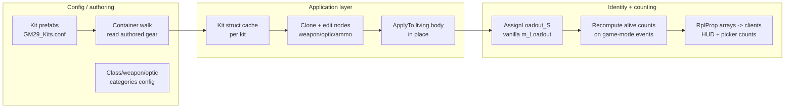

# 29th Kit System — design

**Status:** implemented (in-game verification ongoing) · **Branch:** GUI-Kits-Bae · **Updated:** 2026-08-20
**Scope owner:** 29th ID Reforger dev team

> **Implemented deltas vs the sections below (2026-08-20):**
> - **Keybind is F4** (rebindable, "Kits - 29th ID" keybind category). Picker runs in the
>   vanilla `ConfigurableDialog_Big` shell: title "SELECT KIT - <FACTION>", no internal
>   header, **Apply Kit is a dialog footer button** next to Close.
> - **Optic column:** "None" (not "None — iron sights"); locked classes show the same
>   plain "None" row, not a "locked" label. Badges are `1X` / `MAG`. Per-class
>   fine-grained restriction exists: `m_aOpticExclude` / `m_aOpticInclude` on top of
>   categories. Failed optic swaps restore the previous optic instead of leaving irons.
> - **HUD:** left side, **briefing phase only** (picker stays open for any non-LIVE
>   phase), height sizes to content, **zero-count rows are hidden**, row order follows
>   the side-config class order. Display names standard: Rifleman / Machine Gunner
>   (AR + legacy MG merged) / Anti-Tank (LAT) / Grenadier / Sniper (incl.
>   Sharpshooter) / Squad Leader / Crewman.
> - **Weapon choice = kit choice:** M60/PKM route to the Machine Gunner kits via
>   `m_sSourceKitName` (rig, backpack, sidearm, ammo all correct; truthful identity,
>   respawn, spectator icon).
> - **"Current Kit" deploy entry:** applying in the picker assigns a per-player
>   pseudo-loadout shown selected in the respawn menu; respawn re-dresses from the
>   stash. Counting resolves it to the stashed kit's row.
> - **Item placement:** constraint solver over every container on the body, special
>   equipment slots preferred (visible one first), per-item preferred containers from
>   config, stacks kept together; drops log server-side and notify the player by name.
>   Backend design §7 is authoritative.
> - **Labels** come from in-game display names (ItemDisplayName + translate), config
>   `m_sDisplayName` overrides on weapons and optics.
> - **Config backend implemented** — blocks/aliases/magazine-sets compose all 17 kits
>   from `Configs/KitSystem/Blocks/**` and `Kits/**`, dress and equipment slots
>   included, so a kit's content no longer depends on its prefab. Tooling:
>   `/kitdigest`, `/kitdump`, `/kitcompare` (no argument = sweep every kit),
>   `/kitvalidate` (dry-run every kit, report what would not fit) — all server-side
>   only. See `29th-kit-config-backend-design.md` for the authoritative backend design.
> - **Attachment fitment** is derived, not declared: mount types on the weapon and the
>   attachment are intersected, gating both bayonets and the picker's optic column.

---

## 1. Purpose

Replace the vanilla respawn-menu loadout selection with a unit-controlled kit system:

- Players pick a **class** (Rifleman, MG, Crewman, …) from config-authored, per-team kit lists, then customize the **primary weapon** and — where the class allows it — the **optic** (including *None*).
- **Optic editing is per-class config data.** Currently Rifleman and Marksman (= the existing US Sniper and USSR Sharpshooter kits — no new prefabs) list optic categories; every other class's optic is locked to its kit default. Expanding this to any class is a config edit, zero code.
- **Per-class default optic.** Each optic-enabled class declares a `default optic` that the picker pre-selects — for Marksman that is a scope, so taking an optic is opt-*out*, never something a player forgets because *None* happened to be first. *None* remains selectable (irons as a choice, not an accident).
- Players can **swap kits while alive** during preround — with **zero movement**: not moved an inch, no pose/camera reset.
- Everyone sees a **preround HUD** of how many of each kit are alive on their team, with a count of magnified optics per kit.

### Non-goals (current scope)

- **Customization stops at primary weapon + optic.** No ammo/grenade quantity selection, no secondary/equipment editing.
- **No personal kit save/load** for now.
- **No hard enforcement** of kit limits. Counts are for self-policing and leadership eyeballs only.
- **No admin-side restriction toggles** (dropped for now; the config is the restriction).
- **No mid-round alive HUD.** The HUD hides after preround.

All of these are **deferred, not designed out** — the backend stays shaped to accept them (§15).

---

## 2. Player experience

**At deploy:** the respawn menu lists only 29th kits (existing `GM29_KitLoadouts` injection + prune). Selecting a kit opens/uses the kit picker; APPLY sets the assignment; the spawn pipeline spawns the class prefab and the mutation pass applies the player's weapon/optic/ammo choices.

**Alive in preround:** open the kit picker (keybind), pick a different class or change customization, APPLY re-dresses the living body in place. Position, stance, momentum, camera untouched.

**HUD (preround only):** per-team list — role icon, alive count, and in parentheses the magnified-optic count with a scope glyph. Parenthetical omitted when zero. Zero-count kits still listed. Footer: team total alive + total scopes. Shown to **all connected players** during briefing — including dead players and deploy-menu sitters, so leadership can check counts without a body (counts replicate to everyone regardless).

**Kit picker:** class column limited to **what the player's current squad offers** (the vanilla group-role restriction `GM29_Groups.conf` already authors — `GetPlayerLoadoutsByGroup`/`IsLoadoutInGroup`; no group or unrestricted group falls back to the full faction list, and the server enforces the same filter at apply) → weapon list (per class, from config) → optic list (*None — iron sights* first; every optic badged `1X` or `MAGNIFIED`; list filtered to optics that physically fit the selected weapon) → APPLY KIT. For classes with no optic categories configured, the optic row shows the kit's default optic in a locked (non-interactive) state rather than hiding — a visible default reads as a decision, a missing row reads as a bug. Selections are **per class** — swapping class swaps the customization context; never carry one global optic choice across classes.

**Optic seeding:** on selecting a class, the picker pre-selects its configured `default optic` (Marksman opens with a scope selected, Rifleman with whatever the unit sets — possibly *None*). On a weapon change: keep the current optic if it fits the new weapon, else fall back to the class default if that fits, else *None*. The player never inherits an invisible empty selection.

---

## 3. Architecture: three independent layers



The layers are deliberately decoupled: **how gear gets on the body** (apply) never affects **who counts as what** (identity), and swapping either implementation leaves the other untouched.

---

## 4. Config and authoring

- **Kits remain authored as character prefabs** (`29th_Character_US_MG.et` etc.) — the existing workflow. The container walk (§5) turns prefabs into applyable data automatically; nobody maintains item lists by hand.
- **Vanilla registration stays as-is:** `GM29_KitLoadouts.c` injects kits into `SCR_LoadoutManager` and prunes foreign entries. The loadout-manager **index** is the shared key space for counts and RPCs.
- **New customization config** (new `BaseContainerProps` classes — authoring new config classes is fine; never `modded class` an existing config-deserialized class):

```
RK29_LoadoutSetup (.conf)
├─ OpticCategories[]        name ("1x", "Magnified"), optics[] (prefabs)  ← manually curated
└─ Teams[] (faction key)
   └─ Classes[]             kitId, display name,
                            allowed weapons[]           (prefabs; each with its default magazine)
                            allowed optic categories[]  (empty = optic locked to kit default;
                                                         currently Rifleman + Marksman)
                            default optic               (prefab; picker's initial selection —
                                                         empty = None/irons. Must be in an allowed
                                                         category and fit the default weapon;
                                                         validated at config load, warn loudly)
```

The schema is the openness mechanism: enabling optics for MG is adding category names to one array; ammo caps and similar future knobs are new fields on `Classes[]`, not new systems.

- **Optic classification is manual.** No magnification auto-detection; the category an optic sits in is the truth. Unlisted optics don't exist as far as the picker is concerned. This also sidesteps the 250-mod-pack maintenance problem: curate only what the unit issues.
- **Physical fit is still checked at runtime:** the picker offers only optics from allowed categories *that the selected weapon's attachment slots accept*. Categories say "allowed"; slots say "possible".

---

## 5. Kit capture: container walk (no donor bodies)

**Decision reversed 2026-08-19 after reading the actual kit prefabs:** the 29th's authoring style makes the prefab itself an item list, so the donor-spawn pass (the old spike's approach, and this doc's earlier §5) is unnecessary. Capture is a **container walk** at server start — `Resource.Load` each kit .et and read the authored gear straight off the merged container (the `BaseContainerTools` technique already proven in this codebase):

- `CharacterWeaponSlotComponent` entries → weapon slot prefabs (primary, handgun, grenade)
- `BaseLoadoutManagerComponent.Slots` → clothing prefab per named slot (including values inherited from the base character prefab)
- `SCR_InventoryStorageManagerComponent.InitialInventoryItems` → the full item spawn list, with `TargetStorage` placement hints; **respect `Enabled 0`** entries (the Rifleman kit has one)
- `SCR_EditableCharacterComponent.m_UIInfo` → the kit's **role identity for vanilla consumers** (name, `IconSetName`, image, role labels). Instantiate it from the nested container via `BaseContainerTools.CreateInstanceFromContainer` (the proven technique) and cache it per kit — §7 uses it to re-stamp swapped bodies.

What the donor was supposed to compute turns out unneeded: exact runtime placement (we auto-insert; `TargetStorage` strings are optional hints), and container/weapon internals (spawning the vest prefab brings its pouches, spawning the weapon prefab brings its default mag and attachments — the walk never enumerates inside them).

- Stamp **kitId at capture time** from the prefab being walked — never infer it from contents.
- **Scope of validity:** this works because all 29th kits follow one house authoring style (gear declared on the character; container contents at character level — the "Add Inventory Items to Custom 29th_Vests" commits made this deliberate). A kit authored any other way (script-granted gear, contents inside vest prefabs) is invisible to the walk. **Donor capture remains the documented fallback** if the walk ever hits a wall — and would come back for capacity measurement if ammo selection lands (§15).
- Verify (checklist §13): merged-inheritance reads on loaded containers, auto-placement insertion for loose items, and that vest prefabs don't self-fill duplicates.

---

## 6. Kit struct and apply loop (BRI-style, our own)

We own the format and the apply loop — modeled on BRI_Arsenal's shipped implementation (carved source studied as reference; **no license, no copied code** — it is a map of which APIs work and in what order).

**Struct:** mirrors the authoring format rather than a runtime snapshot: `{ kitId, clothing: {slotName → prefab}, weapons: {slotIndex → prefab}, items: [{targetHint?, prefabs[]}] }`. Because we own the schema, customization is a **data edit**: clone the class struct, swap the weapon prefab, add/remove the optic entry (remove = *None*), apply once. One apply path serves initial-spawn mutation and live re-kit alike. (BRI's deep-recursive tree isn't needed — we dress from authored lists; we never restore a captured arrangement.)

**Magazine auto-swap:** with no ammo selection, a weapon change must still keep the ammo coherent — the edit replaces the kit's primary-weapon magazines (in the weapon *and* in inventory) with the same count of the new weapon's default magazine (declared per weapon in config, §4). If the new mags are bulkier and one doesn't fit, the server's per-item insertion truth handles it gracefully: fill what fits, report back. Never leave the old weapon's mags in the vest.

**Apply (authority only, in place):** strip the living character (walk its slots, `TryDeleteItem` each occupant) → insert clothing into named slots → insert weapons into weapon slots → spawn the item list (`TrySpawnPrefabToStorage`, auto-placement; `targetHint` resolution optional later) → attach/replace the optic on the spawned weapon. The entity never changes → zero movement by construction.

**Landmines (from BRI's source and the authoring format — respect them):**

1. **Attachment ordering:** attachments that depend on other parts (mags on adapters, bayonets on muzzles) go last. With optic-only editing this reduces to: attach the optic after the weapon is fully spawned.
2. **Spawned containers may self-fill:** if any clothing prefab carries its own initial items, clear them before spawning the kit's item list or contents double up. House style puts contents at character level, so expect empty containers — but verify, don't assume.
3. **Same-prefab dedup:** if a slot already holds the right prefab, leave it (minimal churn on small edits — an optic-only change shouldn't re-dress the whole character).
4. **Strip fully before dressing:** partial strips leave orphans (old weapon's mags in pockets); the mag auto-swap only covers the tracked primary mags.

**Rejected alternatives (do not relitigate):**

| Alternative | Why rejected |
| --- | --- |
| Body swap (spawn new prefab, transfer control) | Violates zero-movement: coexisting bodies collide (no script route to disable character collision) or an entity-less frame invites the deploy-menu reopen fight; pose/freelook/camera reset regardless. |
| Vanilla `ApplyLoadoutString` (the spike's path) | Works, but: undocumented BI format that drifts silently, hard `SCR_ArsenalManagerComponent` dependency, opaque strings (customization then needs post-apply entity surgery). Own struct supersedes it. |
| Hand-writing vanilla JSON without a body | Worst quadrant: reimplement instantiation *and* reverse-engineer an internal format. |
| Item-list configs authored by hand | Two hand-maintained representations of every kit; abandons the prefab workflow. The container walk derives the second representation automatically. |
| Donor-body capture (spawn kit prefab, snapshot runtime inventory) | Superseded by the container walk: the house authoring style makes the prefab itself the item list, and everything the donor computed (placement, container internals) is unneeded. Kept as documented fallback for exotic authoring or future capacity measurement. |

---

## 7. Identity and counting

**The one honest record of "what class is this player" is the assigned loadout** (`SCR_PlayerLoadoutComponent.m_Loadout`), updated in the apply chokepoint through a small additive wrapper calling the protected vanilla chain (`CanAssignLoadout_S` → `AssignLoadout_S`). This keeps vanilla's own per-loadout counts, game-mode notifications, and next-respawn kit all consistent for free.

> **Trap, permanent:** after an in-place swap, the body's `GetPrefabData()` still names its birth prefab forever. Never derive class from the entity, the struct, or the string. Anything that needs the answer asks the assignment.

**Body-facing role identity (icons) — pure vanilla, no other mod edited:** vanilla and the spectator show class through the body's editable-entity UI info (`SCR_EditableEntityComponent.GetInfo()`) — GM editor list and Spectator V3's role icons read it. An in-place swap would leave the birth kit's icon on the body, so the kit system uses vanilla's `SetInfoInstance(SCR_UIInfo)` (public; `GetInfo()` prefers the instance over prefab data) with a **one-instance-then-mutate** discipline:

- **At spawn** (inside the mutation pass): `SetInfoInstance` a per-body clone of the kit's UIInfo (captured by the walk, §5). Every consumer that reads *or caches* `GetInfo()` from then on holds **our** object.
- **At class swap:** never touch the component again — **mutate that instance's fields** (name, icon set, image, labels) to the new kit's values. Reference-cachers update for free: Spectator V3 caches the returned reference once per entity appearance but re-renders from it every refresh (`cachedRoleUIInfo.SetIconTo(...)`), so mutation propagates with zero spectator changes. Swapping the instance instead would strand every cacher on the old object — do not.
- `SetInfoInstance` is **local** (not replicated, no invoker) → the stamp and mutations run **per-machine** (same replication class as visibility flags): clients react to the replicated assignment info (`m_aPlayerLoadoutInfo`); the walk runs client-side too, so the loadout→UIInfo map exists everywhere.
- If `SCR_UIInfo` fields lack public setters, the instance is our own `RK29_KitUIInfo : SCR_EditableEntityUIInfo` (copy-from + setters) — created via `new`, never config-deserialized, and it survives the spectator's `SCR_EditableEntityUIInfo` cast.
- **Acceptance criterion (relaxed by design, 2026-08-19):** icon accuracy matters **from round-LIVE until the next preround** — transient preround staleness is acceptable. Any race around spawn/swap timing is therefore a non-issue by definition. Mutation (not instance-swap) is still required by this criterion: a spectator opened during preround that runs into LIVE holds its cached reference all round, and only in-place mutation keeps that viewer correct.

**Alive counts** are a server-derived aggregate, **rebuilt from scratch** on events — never incremented:

- Subscriptions: `OnPlayerSpawned`, `OnPlayerKilled`, `OnPlayerDeleted` / `OnControllableDestroyed`, `OnPlayerDisconnected`, `OnPlayerLoadoutSet_S` (the last covers re-kits and class swaps for free, because apply routes through `AssignLoadout_S`).
- Handler = one debounced `Recompute()` (`CallLater(…, 0)` collapses same-frame bursts): iterate connected players → keep those with a living controlled character (`!IsDead()`; **unconscious counts as alive**) → read assigned loadout → tally alive per kit and magnified per kit (optic read from the player's current stored struct, classified via the optic-category config; a stock kit's default optic must have a category or defaults to not-magnified).
- Why rebuild, not ±1: increments require every event to fire exactly once, in order, with complete coverage — unverifiable across game updates and 250 mods, and one miss corrupts the counter forever. A rebuild's output depends only on present state; a missed event costs one stale frame, healed by the next. Cost is O(players) ≈ microseconds.
- Why not client-side: relevancy/streaming means clients can't reliably see other players' bodies. Alive-ness is only trustworthy on the authority.

**Replication:**

```
[RplProp(onRplName: "OnRK29CountsChanged")] ref array<int> m_aRK29AliveCounts;      // loadout-manager index
[RplProp(onRplName: "OnRK29CountsChanged")] ref array<int> m_aRK29MagnifiedCounts;  // same index space
```

Assign rebuilt arrays (don't mutate in place) so replication notices. Clients resolve index → loadout → name/icon/faction via the loadout manager; HUD and picker both subscribe to the invoker and **rebuild the whole panel on any fire** (immune to notification granularity).

**Semantics:** counts = alive bodies, not claims. A dead player on a respawn timer is not counted; a menu pick with no body yet is not counted. Slot changes appear when the body does.

---

## 8. Client → server flow

```
picker APPLY ──RPC (playerController, RK29_-prefixed)──▶ server chokepoint:
  1. validate: preround (RT BRIEFING phase via server-side probe; no-timer
     fallback per config, default closed), class exists for faction, weapon in
     class list, optic in a class-allowed category + fits weapon slot (or class
     has none → optic must be kit default)                 (client is never trusted)
  2. clone class struct, edit weapon/optic nodes + magazine auto-swap
  3. struct.ApplyTo(living body)          — or stash for spawn-time mutation if dead
  4. RK29_AssignLoadout_S(classLoadout)   — identity update, atomic with apply
  5. (OnPlayerLoadoutSet_S fires) → Recompute() → RplProp → all HUDs update
```

Steps 3–4 live in one server function so the ledger can never disagree with the body.

---

## 9. Persistence

**Kit struct cache:** server memory only, rebuilt every start by the container walk. Never persisted — the prefabs are the source of truth.

**Session selections:** per-player, per-class, server memory (the chokepoint's stash). Nothing written to disk in current scope; personal kit save/load is deferred (§15), and its file format is specified there so the selection model won't need reshaping when it lands.

---

## 10. Fit validation — server truth only, for now

With customization limited to weapon + optic, "does it fit" barely arises: weapon and optic are same-slot replacements, and the only volume change is the magazine auto-swap (§6). Current scope handles that with the **server truth layer alone**: insertion calls return per-item success; fill what fits, report back. The full three-layer design (warmup capacity measurement → client arithmetic → server truth) is parked in §15 and activates with ammo-quantity selection.

---

## 11. Compatibility and conventions

- **Additive modding throughout:** every added member/method `RK29_`-prefixed; every override calls `super` unless documented; widen predicates rather than replace.
- **Never `modded class` a config-deserialized class**; new `BaseContainerProps` classes are fine.
- **`RespawnMenu.layout` collision:** 29th Spectator V3 already overrides this layout (spectate button). This mod must **not** ship a second override — inject UI from script at menu open, or coordinate a single shared override. Only one override of a resource wins.
- **Other mods keying off body prefab names** (trackers, admin tools) will misread class-swapped players — known exposure, on the compatibility radar.
- **29th Round Timer: soft integration, never a dependency.** "Preround" is the Round Timer's BRIEFING phase, read the way Spectator V3 already does it (`SPEC29_RoundTimer.c`): an `RK29_` probe locates the timer's `RT_`-prefixed RplProps on the game mode **by name via Enforce reflection** (`typename.GetVariableName` / `GetVariableValue` — `m_eRTPhase` NONE=0/BRIEFING=1/LIVE=2/ENDED=3, `m_RTPhaseStartTs`, `m_iRTPhaseDurationS`, `m_bRTPaused`, `m_iRTPausedRemainingS`). All vanilla types, no compile-time reference in either direction; Round Timer must not be modified. With the timer loaded, customization is open whenever the phase is **not LIVE** — briefing, no-round-set-up ("off"), and post-round all count as open (decided 2026-08-19; "preround" in this doc means exactly `phase != LIVE`). Addon absent → probe inactive → fallback behavior from config (`no-timer mode: open|closed`, default **closed**: no HUD, no live re-kit, kit choice at deploy only — flip to open in config for dev/casual sessions). Phase is checked **server-side too** in the apply chokepoint (the RplProps are authoritative there) — the client's probe only drives UI. Read on a slow tick (~500 ms, the spectator's precedent) — the fields are foreign RplProps with no subscribable invoker, so this is the one sanctioned poll. Field names are mirrored from RT sources; a rename breaks silently to fallback mode — re-verify after RT updates.
- **BRI_Arsenal carve** (`bri_carve/` scratchpad): research reference only. No license published; do not copy code.
- **Retail vs Diag:** nothing player-facing may depend on `Shape`/debug APIs or Diag-only behavior; peer-tool tests are Diag-to-Diag and prove nothing about retail.

## 12. Existing code disposition

| Code | Disposition |
| --- | --- |
| `GM29_KitLoadouts.c` (inject + prune) | **Keep.** Registration/index space this design builds on. Turn off `GM29_DUMP_LOADOUTS` for deploy. |
| `GM29_GroupPresets.c`, `GM29_Groups.conf`, `GM29_GroupGates.c` | **Keep.** Orthogonal (squad structure + role-restricted kit offering). |
| `RK29_KitApplySpike.c` + chat commands + PC RPC | **Retire.** It proved live re-kit works and documented the arsenal-manager landmine; the vanilla-serializer and donor-capture paths are superseded by §5–6. The PC-RPC shape survives in §8. |

## 13. Verification checklist (prototype order)

1. **In-place apply on a living character** — full class swap (Rifleman→MG) while walking and weapon-raised; expect at most a re-holster, zero displacement. On a **retail-defines client**, not just Workbench peer.
2. **Container walk fidelity** — walked gear list for every kit matches what the prefab spawns naturally (spawn one of each and diff): confirms merged-inheritance reads, `Enabled 0` handling, and that clothing prefabs don't self-fill duplicates.
3. **Optic attach/detach on a spawned weapon** incl. *None* (remove entry) and slot-compatibility filtering; loose-item auto-placement via `TrySpawnPrefabToStorage`.
4. **Magazine auto-swap on weapon change** — swap M16→M14 and back: old mags gone from vest and weapon, correct count of new default mags present, nothing orphaned.
5. **`CanAssignLoadout_S` for a living player** — if the manager's game logic refuses, bypass to `AssignLoadout_S` in the chokepoint (our validation already approved).
6. **RplProp array update idiom** — confirm clients get `OnRK29CountsChanged`; confirm the mutate-vs-assign behavior.
7. **Count correctness sweep** — spawn, die, respawn, swap class, disconnect, GM-delete a body: HUD numbers match reality after each (rebuild should make this boring).
8. **Uncon counts as alive** with the pack's medical mod.
9. **Locked-optic classes** — an APPLY with a tampered optic from a class without optic categories is refused server-side; the picker shows the default optic locked.
10. **Default-optic seeding** — Marksman opens with its scope pre-selected; weapon change re-seeds per the keep → default → None rule; a config default that is out-of-category or doesn't fit the default weapon warns loudly at load.
11. **Round Timer probe** — with the timer loaded: HUD appears at BRIEFING, disappears at LIVE, live re-kit refused server-side after LIVE; without the timer: default-closed fallback governs and nothing errors.
12. **Deploy-menu injection** — picker reachable from the deploy menu with Spectator V3 loaded alongside: its spectate button and our injected UI coexist (no layout override from this mod).
13. **Role-icon instance-mutation** — swap classes during preround, then go LIVE: GM editor entity list and an **unmodified Spectator V3** (including one opened *before* the swap and left running) show the new kit's icon on every machine for the whole live round. Accuracy is asserted at LIVE, not instantly on swap (§7 acceptance criterion). Also settles whether `SCR_UIInfo` fields are settable or the `RK29_KitUIInfo` subclass is needed.

## 14. Open questions

- 3D preview pane in the picker: vanilla preview machinery is reusable but costs half the panel; list-only matches quick preround swaps.
- Short display names per kit in config (loadout names are `29th_US_MG`-style).

Resolved 2026-08-19:
- **"Preround"** = Round Timer BRIEFING phase via the soft probe (§11); no-timer fallback defaults **closed**.
- **Picker entry: both** — in-world keybind menu (the live re-kit path) *and* a deploy-menu presence for pre-first-spawn customization. The deploy-menu side must be **script-injected at menu open** — never a `RespawnMenu.layout` override (Spectator V3 owns that file, §11). Same picker component both places, one code path.
- **Marksman** = the existing US Sniper and USSR Sharpshooter kits, via config only.
- **HUD audience** = all connected players during briefing, spawned or not.

## 15. Deferred features — kept open by design

Each of these has a settled design from this doc's earlier iterations; the backend keeps the seams they plug into. None requires reshaping the three layers.

- **Optics for more classes:** add category names to that class's `allowed optic categories[]`. Config edit only.
- **Ammo/grenade quantity selection:** picker spinners `current / cap`; caps as new `Classes[]` fields; struct edit adjusts mag/frag counts in the item list. Activates the full fit-validation stack: a measuring pass computes per-class free volume/weight and per-item unit volumes (measured, not authored — vest changes self-update; this is where donor spawning returns, as a measurement rig), client arithmetic clamps the spinners, server insertion stays the final word. Upgrade path if the volume-sum overestimate ever bites: measure real insertion maxima per class × mag type.
- **Personal kit save/load:** client-side local JSON `{ kitId, weapon, optic, magCount, fragCount }` — plain ResourceNames and ints, not a character serialization, so it survives game updates; `kitId` makes files self-describing. On load: validate against current config, **load what fits, snap/clear what doesn't** (never all-or-nothing). Server re-validates at apply regardless.
- **Admin restriction toggles:** per-team category/weapon switches layered over the config, replicated with an on-change invoker (spectator-gate pattern); server-side JSON presets. Filters the same lists the picker already reads.
- **Hard kit limits:** enforcement is one check in the existing chokepoint (`count < cap` before apply); counts are already maintained.
- **Mid-round alive HUD:** already what the counting layer computes — the HUD visibility rule is the only change.
